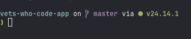

# Terminal Mastery

A collection of shell scripts for automating common development tasks.

## Installation

Clone the repo and make the scripts executable:

```bash
git clone [<url>](https://github.com/jinu2ID/vwc-coursework.git)
cd terminal-mastery
chmod +x scaffold.sh logscan.sh deploy.sh
```

## Scripts

### scaffold.sh

Spin up a new project folder with git, a README, and a .gitignore in one command.

```bash
./scaffold.sh <project-name>
```

**Example:**

```bash
./scaffold.sh my-app
```

---

### logscan.sh

Grep, sort, and count matching lines from a log file and print a summary.

```bash
./logscan.sh <logfile> [pattern]
```

- `pattern` is optional and defaults to `ERROR`

**Examples:**

```bash
./logscan.sh app.log
./logscan.sh app.log WARNING
```

**Run tests:**

```bash
./test_logscan.sh
```

---

### deploy.sh

Run tests, build, and push. Fails loudly on any error.

```bash
./deploy.sh [branch]
```

- `branch` is optional and defaults to `main`
- Requires a clean working tree (no uncommitted changes)
- Uses `npm test` and `npm run build` — swap these for your project's toolchain

**Example:**

```bash
./deploy.sh staging
```

---

## Custom Prompt


